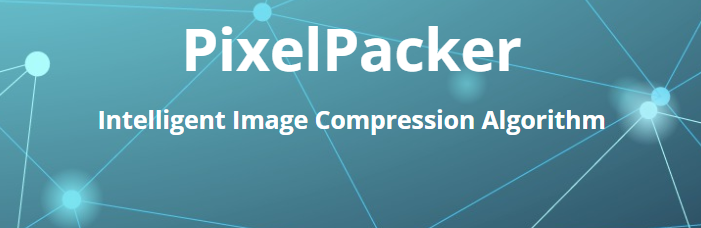

<h1>PixelPacker</h1>

 

<h1>How it Works?</h1>
<h2>Step 1:</h2>

>python3 web_flask/route.py

 
You will see: 

<h2>Step 2:</h2>

>click on <http://localhost:5000>

 
You will see something like this opened with your default browser:

<h2>Step 3:</h2>
<ol>

1- Choose a file from your files

2- Choose the format to convert to and,
 

3- Click the <strong>Convert</strong> button.

</ol>

<h2>Step 4:</h2>

The <strong>Download</strong> Button will appear after conversion is complete. You'll notice at the same time the <strong>File Size</strong> before and after conversion.

 
<h3>Author</h3>

